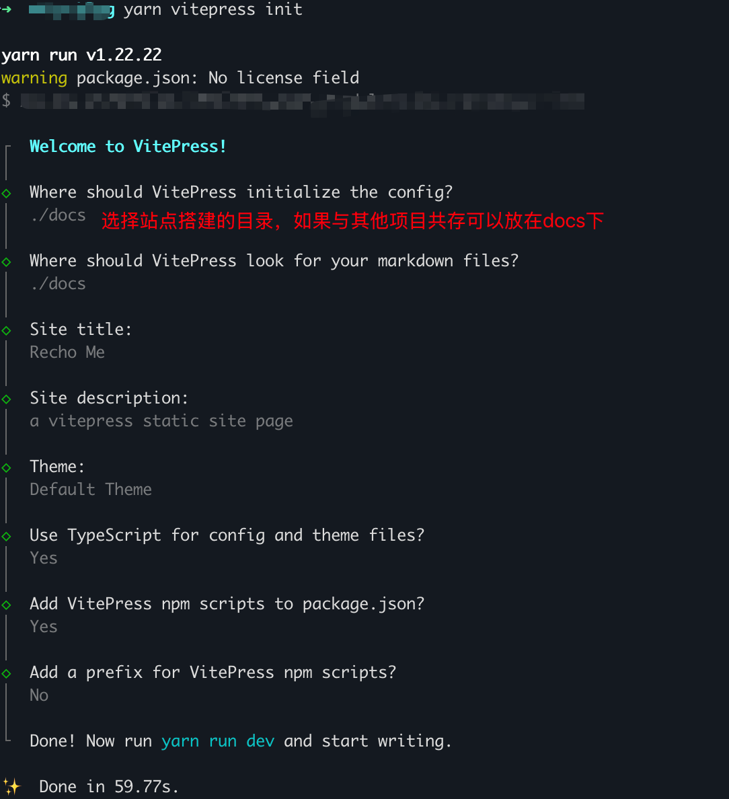
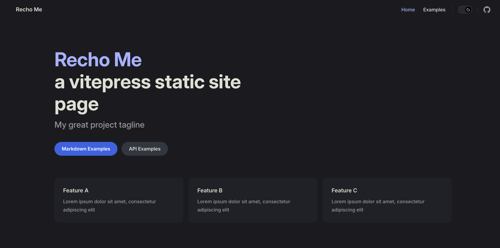
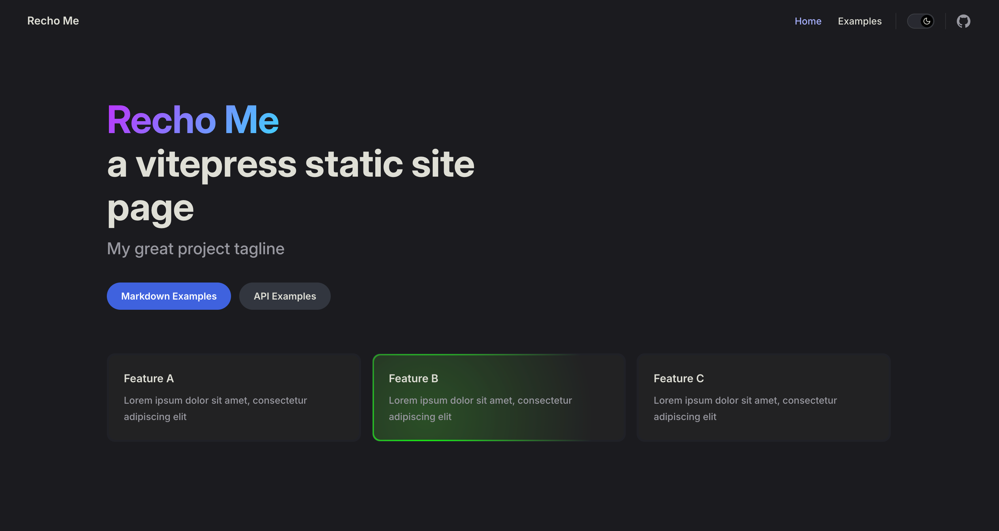

# Create Vitepress Blog

## 安装
### [Prerequisites]前提条件
- [Node.js](https://nodejs.org/zh-cn) 22 及以上版本
- 了解 [Markdown](https://en.wikipedia.org/wiki/Markdown) 基本语法

### [Create]新建仓库

> 新建项目文件夹
```bash
mkdir blog
cd blog
```

> 安装VitePress，VitePress 可以单独使用，也可以安装到现有项目中。

```bash
yarn add -D vitepress@next vue
npm add -D vitepress@next
pnpm add -D vitepress@next
bun add -D vitepress@next
```

> 安装向导 · 以 `yarn` 举例
vitePress 附带一个命令行设置向导，安装后，通过运行以下命令启动向导：
```bash
yarn vitepress init
```

> 需要回答几个简单的问题：


> 项目启动: `yarn run dev`, 启动效果


---
关于本地部署:
打包命令: `yarn build`
打包后预览: `yarn preview`

### [页面配置]

参考文档：[默认主题配置](https://vitepress.dev/zh/reference/default-theme-config)

在 `themeConfig` 中可配置以下页面相关选项：

```ts
themeConfig: {
  // Logo（支持浅色/深色模式）
  logo: '/logo.jpg',
  // 或使用不同 logo：
  // logo: { light: '/logo-light.jpg', dark: '/logo-dark.jpg' }

  // 站点标题（覆盖默认 title）
  // siteTitle: '我的博客',

  // 导航菜单
  nav: [
    { text: 'Home', link: '/' },
    { text: 'Dropdown', items: [
      { text: 'Item A', link: '/a' },
      { text: 'Item B', link: '/b' }
    ]}
  ],

  // 侧边栏
  sidebar: {
    '/': [
      {
        text: '指南',
        items: [
          { text: '首页', link: '/' },
          { text: '开始', link: '/guide/getting-started' }
        ]
      }
    ]
  },

  // 页脚
  footer: {
    message: 'Released under the MIT License.',
    copyright: 'Copyright © 2024-present Your Name'
  },

  // 编辑链接
  editLink: {
    pattern: 'https://github.com/username/repo/edit/main/docs/:path',
    text: '在 GitHub 上编辑此页'
  },

  // 最后更新
  lastUpdated: {
    text: '最后更新',
    formatOptions: {
      dateStyle: 'long',
      timeStyle: 'short'
    }
  },

  // 页面导航文本（上一页/下一页）
  docFooter: {
    prev: '上一页',
    next: '下一页'
  },

  // 大纲（右侧目录）
  outline: {
    level: [2, 3],  // 显示 h2 和 h3
    label: '页面导航'
  },

  // 外部链接图标
  externalLinkIcon: true,

  // 社交链接
  socialLinks: [
    { icon: 'github', link: 'https://github.com/your-username' },
    { icon: 'twitter', link: 'https://twitter.com/your-username' }
  ]
}
```

#### 在页面中覆盖配置

每个页面的 frontmatter 可以覆盖部分配置：

```yaml
---
outline: [2, 4]      # 只显示 h2 和 h4
outlineLabel: '目录'
lastUpdated: false   # 禁用最后更新
editLink: false      # 禁用编辑链接
---
```

### [Theme]使用Theme · 以 fuxishi-vitepress-theme 为例
**安装**
```bash
yarn add @fuxishi/vitepress-theme
yarn add vitepress
```
**注册主题**
创建或修改 `.vitepress/theme/index.ts`
```ts
import FxTheme from "@fuxishi/vitepress-theme"
import "@fuxishi/vitepress-theme/style.css"

export default FxTheme
```
**继承配置**
创建或修改 `.vitepress/config.mts`：
```ts
import { defineConfigWithTheme } from "vitepress"
import fxConfig from "@fuxishi/vitepress-theme/config"
import type { FxThemeConfig } from "@fuxishi/vitepress-theme/config"

const defaultConfig = {
  title: "Recho Me",
  description: "a vitepress static site page",
  extends: fxConfig,
  themeConfig: {
    // https://vitepress.dev/reference/default-theme-config
    nav: [
      { text: 'Home', link: '/' },
      { text: 'Examples', link: '/markdown-examples' }
    ],

    sidebar: [
      {
        text: 'Examples',
        items: [
          { text: 'Markdown Examples', link: '/markdown-examples' },
          { text: 'Runtime API Examples', link: '/api-examples' }
        ]
      }
    ],

    socialLinks: [
      { icon: 'github', link: 'https://github.com/vuejs/vitepress' }
    ]
  }
};

export default defineConfigWithTheme<FxThemeConfig>(defaultConfig)

```



#### Theme list
- [fuxishi-vitepress-theme](https://fuxishi-vitepress-theme.fuxizjxzy.cn/)
- [vitepress-blogs-theme](https://chunge16.github.io/vitepress-blogs-theme/)
- [duxweb](https://duxweb.github.io/vitepress-theme)
- [catppuccin](https://vitepress.catppuccin.com/)
- [sugarat](https://theme.sugarat.top/en/)

### [自动侧边栏] vitepress-sidebar

[vitepress-sidebar](https://github.com/jooy2/vitepress-sidebar) 可以自动根据文件结构生成侧边栏。

**安装**
```bash
npm install vitepress-sidebar
```

**使用**
```ts
import { withSidebar } from "vitepress-sidebar"

const config = defineConfig({ /* ... */ })

export default withSidebar(config, [
  {
    documentRootPath: '/docs',           // 文档根目录
    scanStartPath: 'research/blogs',     // 扫描起始路径
    resolvePath: '/research/blogs/',     // 解析路径
    useTitleFromFrontmatter: true,        // 从 frontmatter 获取标题
    useTitleFromFileHeading: true,        // 从文件标题获取
    collapsed: false,                     // 是否默认折叠
  },
])
```

**配置选项**
| 选项 | 说明 |
|------|------|
| `documentRootPath` | 文档根目录路径 |
| `scanStartPath` | 从哪个目录开始扫描 |
| `resolvePath` | URL 解析路径 |
| `useTitleFromFrontmatter` | 从 frontmatter 的 `title` 获取标题 |
| `useTitleFromFileHeading` | 从文件的第一个 `#` 标题获取 |
| `collapsed` | 侧边栏组是否默认折叠 |

### [完整配置示例]

结合所有配置，完整的 `.vitepress/config.mts` 示例：

```ts
import { defineConfigWithTheme } from "vitepress"
import fxConfig from "@fuxishi/vitepress-theme/config"
import type { FxThemeConfig } from "@fuxishi/vitepress-theme/config"
import { withSidebar } from "vitepress-sidebar"

const vitepressConfig = defineConfigWithTheme<FxThemeConfig>({
  title: "贰茶のBlog ~ Coding everywhere",
  description: "Welcome to Recho's Blog",
  extends: fxConfig,
  head: [["link", { rel: "icon", href: "/logo.jpg" }]],
  themeConfig: {
    nav: [
      { text: "Home", link: "/" },
      { text: "Tools And Skills", link: "/nav/tools" },
      { text: "Projects", link: "/nav/projects" },
      { text: "Profile", link: "/nav/profile" },
    ],

    socialLinks: [
      { icon: "github", link: "https://github.com/your-username" },
      { icon: "gitee", link: "https://gitee.com/your-username" },
    ],

    footer: {
      message: "Released under the MIT License.",
      copyright: "Copyright © 2019-present Your Name",
    },

    editLink: {
      pattern: "https://github.com/your-username/your-repo/edit/main/docs/:path",
      text: "在 GitHub 上编辑此页",
    },

    lastUpdated: {
      text: "最后更新",
      formatOptions: { dateStyle: "long", timeStyle: "short" },
    },

    docFooter: { prev: "上一页", next: "下一页" },
    outline: { level: [2, 3], label: "页面导航" },
    externalLinkIcon: true,
    returnToTopLabel: "返回顶部",
  },
})

export default withSidebar(vitepressConfig, [
  {
    documentRootPath: '/docs',
    scanStartPath: 'research/blogs',
    resolvePath: '/research/blogs/',
    useTitleFromFrontmatter: true,
    useTitleFromFileHeading: true,
    collapsed: false,
  },
])
```


## 参考链接
[VitePress](https://vitepress.dev/)

[fuxishi-vitepress-theme](https://fuxishi-vitepress-theme.fuxizjxzy.cn/)

[vitepress-sidebar](https://github.com/jooy2/vitepress-sidebar)